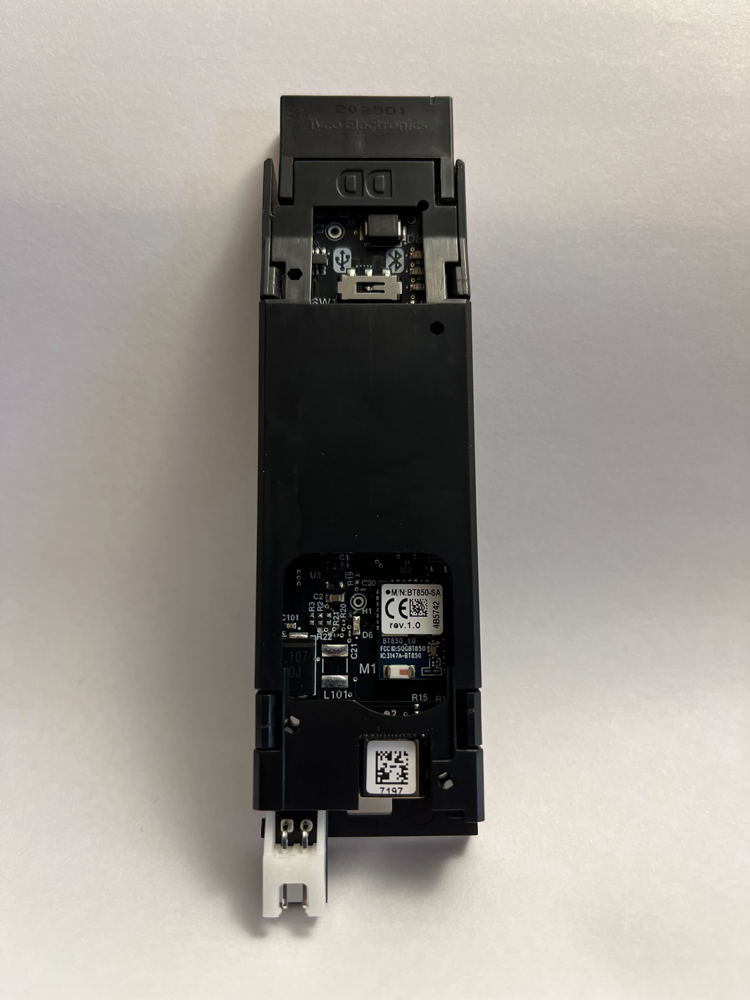

# iRobot® Create® 3 Electrical System

## Robot Battery
The iRobot® Create® 3 robot uses a standard [Lithium Ion Battery for Roomba® e & i series](https://store.irobot.com/default/parts-and-accessories/roomba-batteries/) robots.
The battery shipping with the robot is a 26 Wh, 4S Lithium Ion smart battery pack, with a nominal voltage of 14.4 V (12 V min, 16.8 V max).
The battery will self-protect and disconnect from any load at around 10 V.
Do not attempt to use the robot without its battery installed.

## Adapter Board Overview
The iRobot® Create® 3 robot has two electrical connections exposed via the Adapter Board.
The connections are accessible within the robot once the cargo bay is removed.
The Adapter Board is also visible through the top cover of the robot, where its indicators are visible, and the USB/BLE toggle can be switched.

## Power Connections
### Unregulated Battery Port
The **unregulated battery port** is a JST XH-style connector, with pin 1 as the positive terminal of the battery, and pin 2 is the negative terminal.
These terminals are labeled on the bottom side of the board and are visible with the robot on its back and the cargo bay removed.
The board is capable of supplying a maximum of 2 A of current at the current battery voltage, enforced by a PTC resettable fuse in the robot.
This port is always on when the battery is powered on.
Be careful not to back-feed the robot through this port.

Do not attempt to use the robot without its battery installed.

### USB-C® Connector
The **USB-C® connector** provides a USB 2.0 Host connection into the robot with 5.13 V at 3.0 A provided to power downstream connections.
The power is disabled on this port unless a proper USB-C® downstream device is connected.
The 5 V source powering this port will shut off when the battery voltage falls below approximately 11.8 V.
The USB data connection is made only when the USB/BLE toggle switch plunger is slid toward the USB icon.

### Total Power Output
A note about total power consumption: the USB-C® port draws its power from the unregulated battery connection from the robot.
This means that if a full 5 V @ 3 A are drawn from the port, that's power that cannot be taken from the unregulated battery port.
As an example, say that the battery is currently measuring 14.4 V and the full 5 V @ 3 A are drawn continuously, and the switching regulator is 90% efficient.
In this case, a maximum of (5 V * 3 A / 0.90 / 14.4 V =) 1.16 A can be drawn from the unregulated battery port before the resettable fuse will trip (and depending on ambient temperature, even more margin may be necessary).

## USB/BLE Toggle
The **USB/BLE toggle** routes the robot's single USB Host connection either to the USB-C® port (useful for connecting to single-board computers with OTG or device ports) or to the on-board BLE module.
This module can be used to interact with the [iRobot Coding app](https://code.irobot.com).

## Indicators
### Orange Indicator
The **orange indicator (D3)** is illuminated when the USB-C® port is powering a downstream device, whether or not a data connection is being made.

### Yellow Indicator
The **yellow indicator (D2)** is illuminated when the robot's internal 5 V bus is enabled. There is an error if this LED is extinguished.

### Green Indicator
The **green indicator (D300)** is illuminated when the robot's battery is switched on.

### Blue Indicator
The **blue indicator (D6)** is illuminated when the BLE radio is turned on. It flashes when it is connected to a host.

The Bluetooth® word mark and logos are registered trademarks owned by Bluetooth SIG, Inc. and any use of such marks by iRobot is under license. USB-C® is a trademark of USB Implementers Forum. All other trademarks mentioned are the property of their respective owners.
