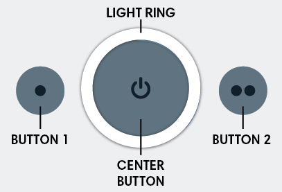
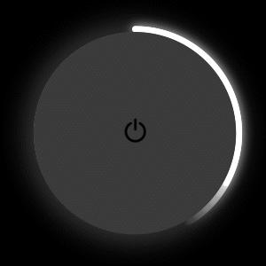
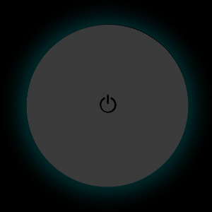
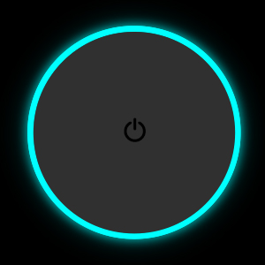
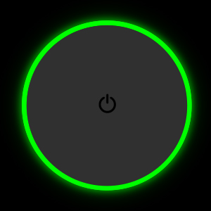
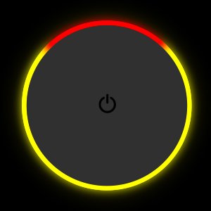
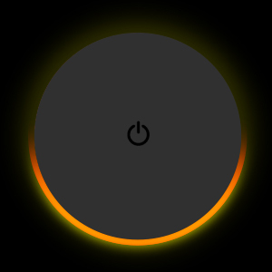

# iRobot® Create® 3 Buttons and Light Ring

## Buttons
The iRobot® Create® 3 has three buttons on its top face.
These buttons expose core functionality of the robot, but can also be overridden by the user.

### Button 1
Button 1 (to the left of center) is marked with a single dot (•).
If held for ten seconds, the robot will go into "standby" mode, keeping its charging circuitry active, and continuing to power the payload.
The robot can be placed on the dock to charge or to keep the payload alive in this mode.
To wake the robot from standby, hold the center button for one second.
Button presses can be accessed by the user in both ROS 2 and iRobot Education Bluetooth[^1] modes.

### Button 2
Button 2 (to the right of center) is marked with two dots (••).
This button is a user button only.
Button presses can be accessed by the user in both ROS 2 and iRobot Education Bluetooth[^1] modes.

### Center Button
The center button is marked with a power (⏻) icon.
If held for seven seconds, the robot will go into "storage mode," disconnecting its internal battery from the robot and its payload.
When the robot is in storage mode, the only way to power it on is to place it on the dock.
The button also contains a light ring on its circumference.

## Light Ring
The center button contains a ring of six RGB LEDs which communicate state about the robot.
The LEDs expose internal state information about the robot, but can also be overridden by the user.

### While Charging
|  Spinning White  |  Partial White  |  Solid White  |  Pulsing Red  |
| ----- | ----- | ----- | ------ |
|  {: style="height:100%;width:100%"}  |  {: style="height:100%;width:100%"}  |  {: style="height:100%;width:100%"}  |  {: style="height:100%;width:100%"}  |
|  Robot is booting up. Wait for "happy sound" to play.  |  Robot is charging (Example shows 40%)  |  Robot is 100% charged  |  Battery < 10%  |

### While Idle
|  Spinning White  |  Solid White  |  Pulsing Red  |  Solid Red  |
| ----- | ----- | ----- | ------ |
|  {: style="height:100%;width:100%"}  |  {: style="height:100%;width:100%"}  |  {: style="height:100%;width:100%"}  |  {: style="height:100%;width:100%"}  |
|  Robot is booting up. Wait for "happy sound" to play.  |  Robot is powered on  |  Battery <10%. Place on charger.  |  Robot error. Cycle power.  |

### While Connecting to Robot Access Point
|  Spinning Cyan  |  Solid Cyan  | | |
| ----- | ----- | ----- | ----- |
|  {: style="height:100%;width:100%"}  |  {: style="height:100%;width:100%"}  | | |
|  Access Point is active.   Select robot from device’s   Wi-Fi menu.  |  Device is connected to   robot’s Access Point page.  | | |

### While Connecting to Wi-Fi
|  Solid Cyan  |  Spinning Cyan  |  Quick Green Flash  |  Solid White  |
| ----- | ----- | ----- | ----- |
|  {: style="height:100%;width:100%"}  |  {: style="height:100%;width:100%"}  |  {: style="height:100%;width:100%"}  |  {: style="height:100%;width:100%"}  |
|  Device is connected to   robot’s Access Point page.  |  Robot attempting to   connect to Wi-Fi  |  Success connecting to Wi-Fi  |  Robot successfully   disconnected from   Access Point page  |

|  Yellow with Red  |  Yellow with Green  |  Yellow with Blue  |  Yellow with White  |  Solid Yellow  |
| ----- | ----- | ----- | ----- | ----- |
|  {: style="height:100%;width:100%"}  |  {: style="height:100%;width:100%"}  |  {: style="height:100%;width:100%"}  |  {: style="height:100%;width:100%"}  |  {: style="height:100%;width:100%"}  |
|  Failed Wi-Fi password  |  Robot cannot connect to   network access point | DHCP failed to obtain a valid   IP address before time-out.   Try again. |  Access point located but   failed association. Try again.  |  Failed to connect to Wi-Fi   for unknown reason  |

### While Updating Firmware
|  Solid Cyan  |  Spinning Blue  |  Spinning White  |  Solid White  |
| ----- | ----- | ----- | ----- |
|  {: style="height:100%;width:100%"}  |  {: style="height:100%;width:100%"}  |  {: style="height:100%;width:100%"}  |  {: style="height:100%;width:100%"}  |
|  Device is connected to   robot’s Access Point page.  |  Robot downloading   update file  |  Robot updating firmware   Do not remove from dock  |  Update successful  |

### While Operating
|  Spinning White  |  Solid White  |  Pulsing Red  |  Spinning Red  |  Half Solid Orange  | Half Solid Yellow  |
| ----- | ----- | ----- | ----- | ----- | ----- |
|  {: style="height:100%;width:100%"}  |  {: style="height:100%;width:100%"}  |  {: style="height:100%;width:100%"}  |  {: style="height:100%;width:100%"}  |  {: style="height:100%;width:100%"}  |  {: style="height:100%;width:100%"}  |
|  Robot is booting up. Wait for "happy sound" to play.  |  Default light color  |  Battery < 10%  |  Battery < 3%  |  Back-up safety activated  |  Wheels disabled  |

[^1]: The Bluetooth® word mark and logos are registered trademarks owned by Bluetooth SIG, Inc. and any use of such marks by iRobot is under license.
[^2]: All other trademarks mentioned are the property of their respective owners.