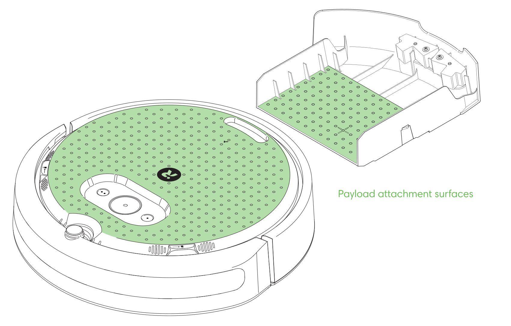
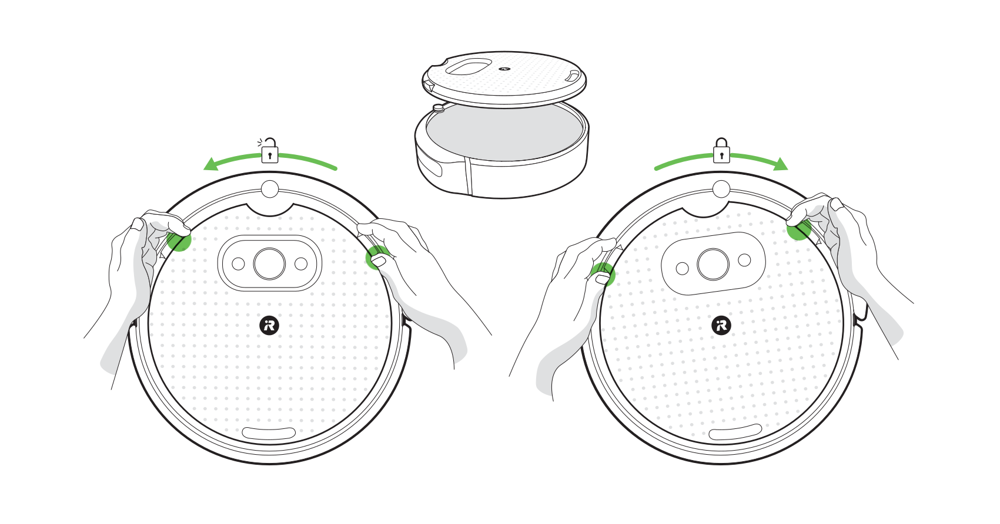
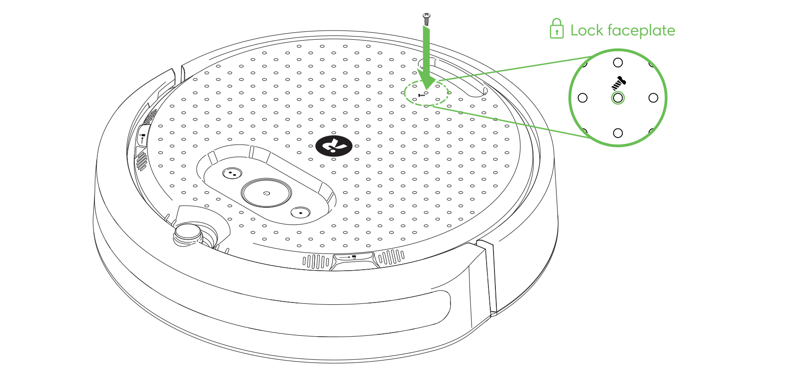
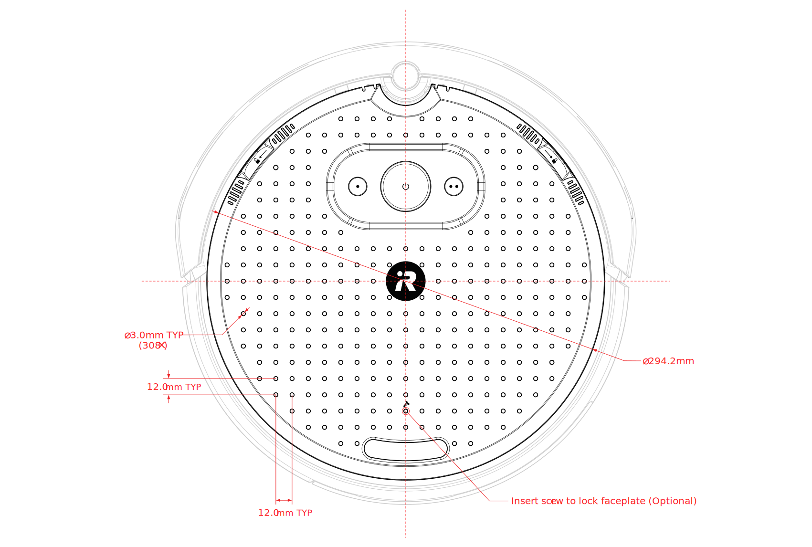
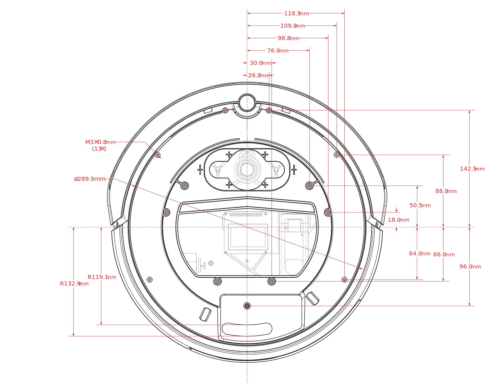
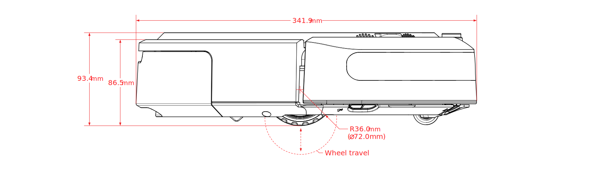
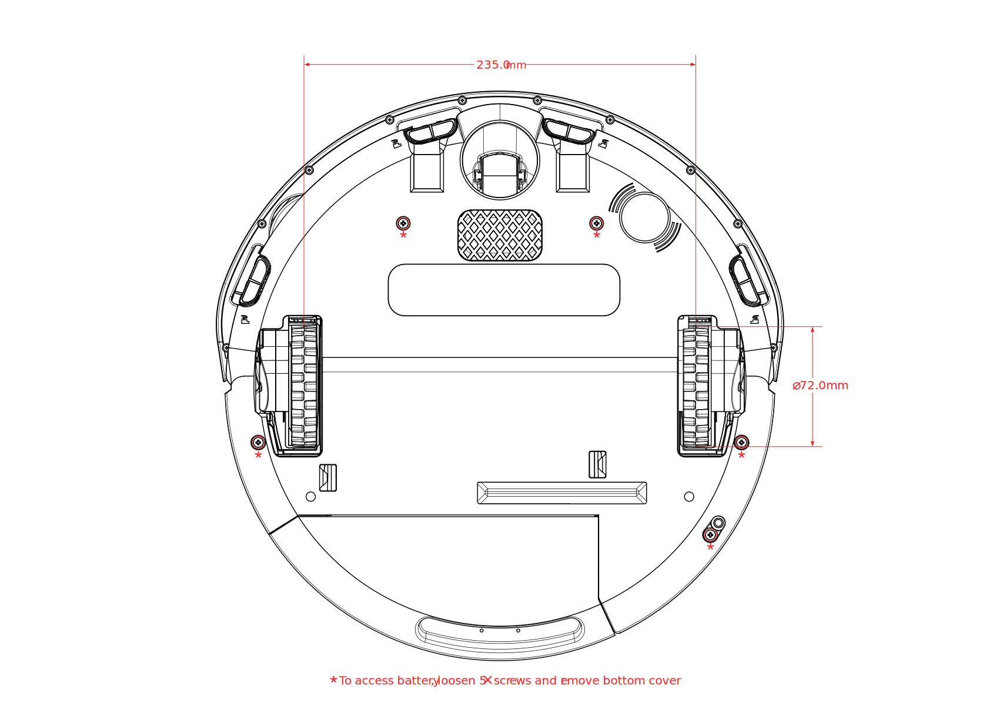
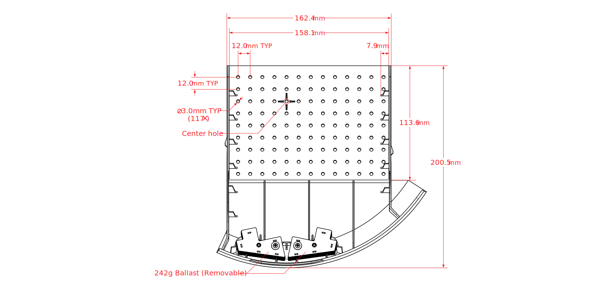

# iRobot® Create® 3 Mechanical System

The Create® 3 is a differential drive robot designed for traversing relatively-flat, indoor environments.
The drive wheels feature independent suspensions to help the robot overcome typical carpet or door thresholds.

## Payload

Sensors or accessories can be attached to the faceplate or internal cargo bay, both of which feature a regular 12 mm grid of 3 mm diameter mounting holes.
The maximum recommended payload weight (without changing acceleration limits) is 9 kg directly above the center of gravity of the chassis.
The robot can handle more weight with reduced acceleration limits or careful management of the load.

## Removing or attaching the faceplate
The faceplate is removed by rotating it on the center axis of the robot using the thumb rests.
The locating pins on the top cover are used to install and retain the faceplate.

!!! attention "Notice"
    To prevent damage to the robot or payload, ensure the faceplate and/or payload are well secured to the chassis before use.

### Locking the faceplate
If you would like to lock the faceplate and prevent it from rotating, you may use an M3 screw or pin in the faceplate hole marked with the image of a screw.

## Attachment Tips and Tricks
### Self-tapping screws with bosses
The Create® 3 robot's holes are sized for M3 or #4 screws.
It is possible to use special self-tapping plastic screws (or in a pinch, sheet metal or wood screws) to screw through the cover into a 3D-printed boss.
Many of our example STLs use this technique.
### Machine screws with nuts
The Create® 3 robot's holes are sized for M3 or #4 screws.
### Cable ties
Cable ties (also known as zip ties) can be threaded through the 3 mm holes.
2.5 mm widths are common and fit nicely.
### Twist ties
Twist ties are a quick, cheap, and reusable way for holding wires or other non-structural pieces. 
### Plastic Rivets
Push-in, split-shank plastic rivets (either for M3 or 0.115" holes) are fast and inexpensive ways to mount thin stock to the Create® 3 robot's faceplate.
### Highly sophisticated interlocking brick system
The typical toy brick has its studs spaced at 8 mm, while Create® 3's holes are spaced at 12 mm.
It is possible to place an [adapter (576 kB)](data/C3-Stud-Mount.stl) into every other hole in order to connect toy bricks to the Create® 3.
We recommend printing at 100% infill.

## Downloadable 3D Model

Download this [STEP model (17.8 MB)](data/iRobot_Create_3_Public_Model.step)[^1] to help design attachments or payloads for Create® 3.
[^1]: Copyright © 2021-22 iRobot Corporation. All Rights Reserved.

!!! attention "Notice"
    Always remove the Create® 3 robot’s faceplate prior to dismantling, adjusting, altering, or affecting the faceplate at the risk of damaging the robot.

!!! attention "Notice"
    Always remove the Create® 3 robot’s battery prior to dismantling, adjusting, altering, or affecting the robot’s chassis at the risk of damaging the battery, robot, or both.

## Dimensioned Drawings
### Top with Faceplate Attached

### Top with Faceplate Removed

### Side View

Wheel travel is approximately 30 mm.
### Bottom View

### Cargo Bay - Top

