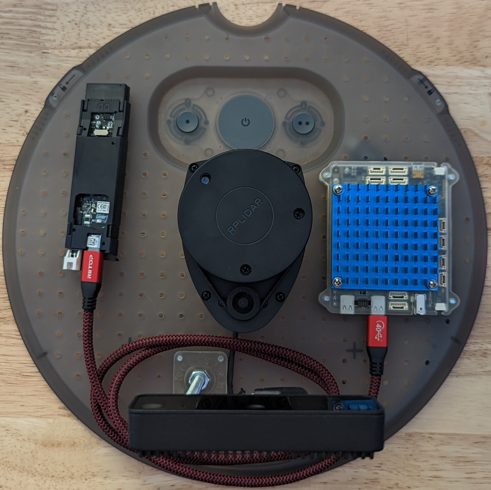

# iRobot® Create® 3 Hookup Guide for NavQPlus by NXP®

!!! important
    **This is community-submitted content. Please feel welcome to submit PRs for additions or corrections.**

The iRobot® Create® 3 robot has a USB-C®[^1] connector implementing a USB 2.0 host capable of 5 V @ 3 A continuous, which can be used to power and communicate with various downstream devices.

NavQPlus is an open source reference design provided by NXP® and manufacturable by anyone.
Since NavQPlus has USB-C® ports capable of being configured as a USB Ethernet Gadget, a cable with a USB-C® connector on both ends is all that is required.

!!! note
    - Unless set otherwise, the default USB-C® port for use as an Ethernet Gadget device is configured to only the centermost USB-C® port (labeled USB 2) as shown in the example pictures.

The NavQPlus is pictured in the cargo bay using the 3D-printed [adapter](../print_compute/#adapter-plate) plate and on top of the faceplate using the 3D-printed [case](../print_compute/#navqplus-by-nxp).

## Printable Case
The [NavQPlus has a printable case](../print_compute/#navqplus-by-nxp) specifically designed for use with the Create® 3, allowing for it to be mounted to the faceplate or cargo bay.
The [base](../print_compute/#case-base) of the case attaches to the NavQPlus using the existing four (4) M2.5-0.45 x 12mm System On Module (SOM) mounting screws.

!!! note
    - The [top](../print_compute/#case-top) case is designed to be fastened together to the [base](../print_compute/#case-base) of the case with four (4) M3-0.5 x 10mm screws if not mounted to a Create® 3 plate or M3-0.5 x 12mm if mounted; cap head is suggested.
    - For best results, it is suggested to tap/thread the M3-0.5 on the [top](../print_compute/#case-top) case and M2.5-0.45 (SOM) holes on the [base](../print_compute/#case-base) case.

Setup showing faceplate mounted case and printable [minimal lidar](../print_sensor_mounts/#rplidar-a1-minimal-mount) and camera [bolt post](../print_generic/#bolt-post-mount) mounts.

## Printable Adapter
If a more minimal mount is desired instead of a case, an [adapter plate](../print_compute/#adapter-plate) using the existing SOM mounting screws for fastening is also provided.

!!! note
    - This [adapter](../print_compute/#adapter-plate) is designed to be fastened to the Create® 3 plate with four (4) M3-0.5 x 6mm screws; cap head is suggested.
    - For best results, it is suggested to tap/thread the M3-0.5 (Create® 3 mounting) and M2.5-0.45 (SOM) holes.

[^1]: USB-C® is a trademark of USB Implementers Forum.
[^2]: All other trademarks mentioned are the property of their respective owners.
