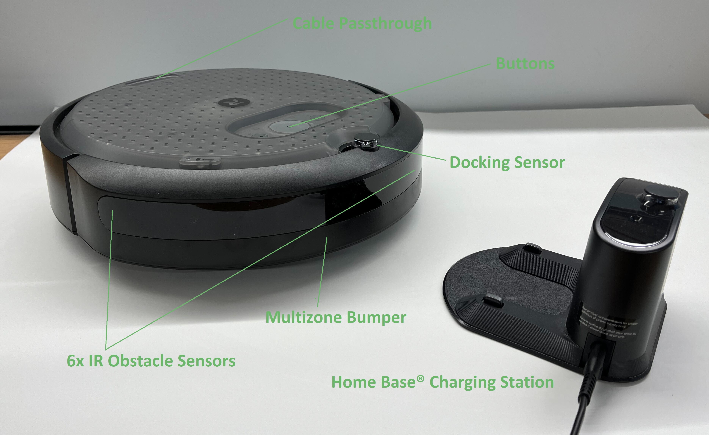
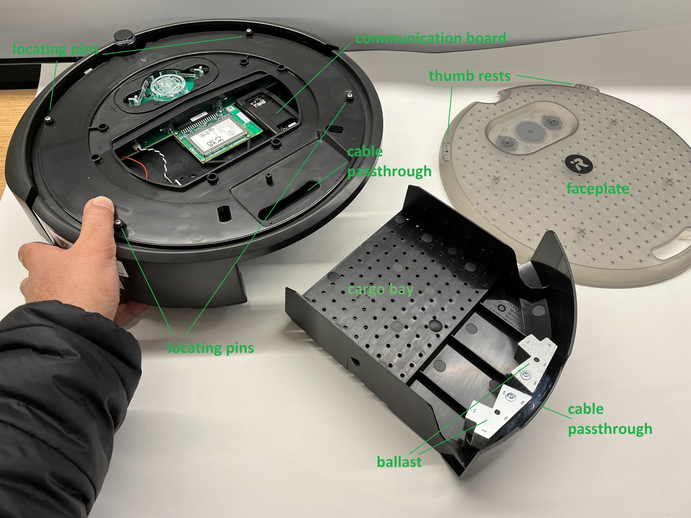
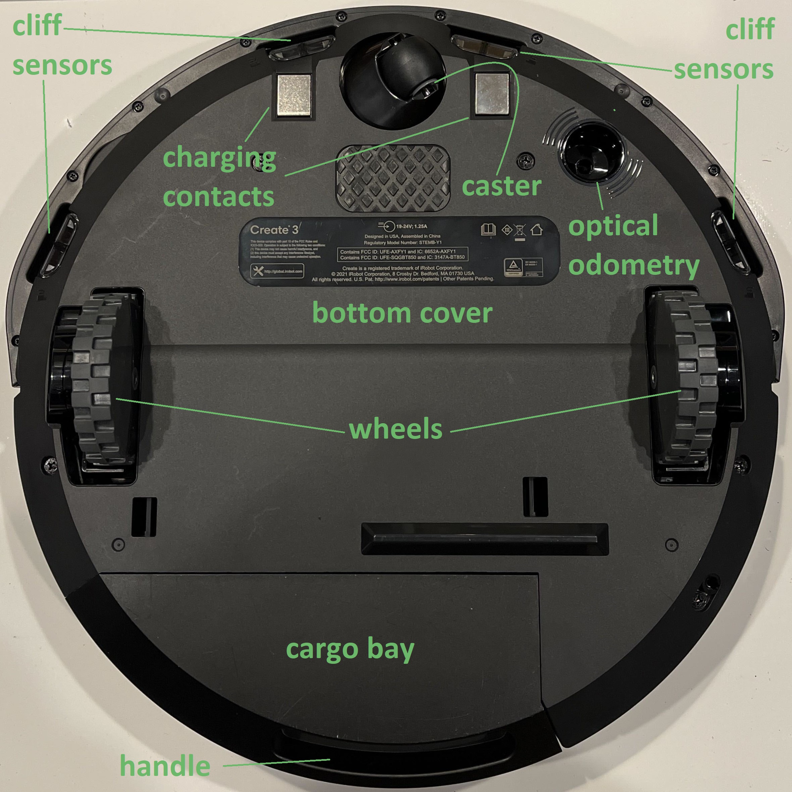

# iRobot® Create® 3 Hardware Overview
The Create® 3 is based on the Roomba®, a robot vacuum cleaner.
Its sensors, actuators, and compact design are capable of navigating and mapping a the whole floor of a home or office space.
The robot also ships with an iRobot® Home Base™ Charging Station.

 
The front of the robot features a multizone bumper with seven pairs of IR proximity sensors, which can be used to detect obstacles.
The top of the robot contains three buttons which can all be overloaded by a ROS 2 application (only the • and •• buttons can be overloaded using the iRobot Education Bluetooth®[^1] protocol.)
The power button features a ring of six RGB LEDs for indication.

 
The faceplate and cargo bay of the robot feature a regular hole pattern for attaching payloads and can be removed without tools for quick prototyping.
There are two cable passthroughs: one on the top edge of the cargo bay which is good for quick prototyping and one that penetrates the top cover and faceplate which is useful for keeping wires within the radius of the robot.
More information on these features can be found on the [Mechanical](../mechanical/) page.

Also visible with the faceplate removed is the adapter board, which is used to interface to external computers either through Bluetooth®[^1] or via USB-C®[^2].
More information on this board is available on the [Electrical](../electrical/) page.

 
The bottom of the robot includes four cliff sensors to keep the robot on solid ground, a front caster (by default, the robot's center of gravity is forward of the center axis), charging contacts, two wheels with current sensors and encoders, and an optical odometry sensor.
Not visible is the robot's IMU, which is used with the optical odometry sensor and wheel encoders to generate a fused odometry estimate.

[^1]: The Bluetooth® word mark and logos are registered trademarks owned by Bluetooth SIG, Inc. and any use of such marks by iRobot is under license.
[^2]: USB-C® is a trademark of USB Implementers Forum.
[^3]: All other trademarks mentioned are the property of their respective owners.