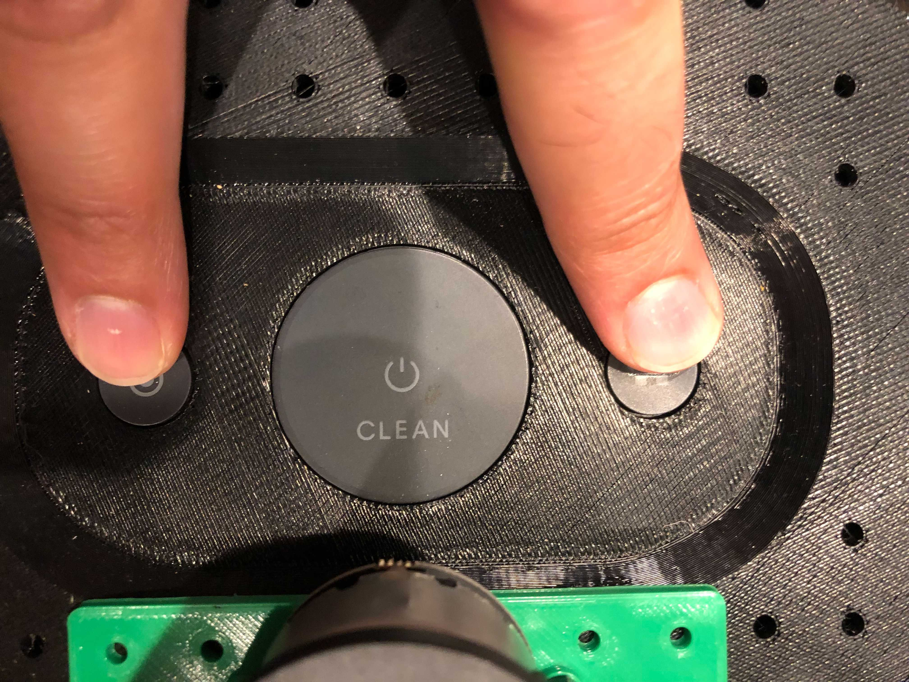

# Webserver

The Create3 webserver is a web interface for debugging an setting up your robot.

If the robot is on the same WiFi network as your laptop, then you can access the webserver opening a browser at the following address: `http://irobot-701c264ad869434e8e11deace38d2bb8.local/`.
Here the string `irobot-701c264ad869434e8e11deace38d2bb8` is the hostname of your robot.
You can read it while doing the provisioning step.

If the robot is not connected to your network, then you should follow the provisioning procedure.
Provisioning is also required for WiFi ROS 2 connectivity and to have UTC synchronized robot timestamps.

## Provisioning 

Provisioning is the procedure that will connect the Create3 robot to your WiFi network.

Press and hold the left ( · ) and right ( · · ) buttons for six seconds.
The light ring should go cyan.

The robot is now broadcasting on an SSID of the form Roomba-####, where #### is some UID.
Connect your computer to it.
Your computer may complain about a lack of Internet access (you can ignore this).

Check the IP address of your computer after you connected to this new WiFi network.
For example, on a Linux machine, you can use the `ifconfig` command and check for your WiFi connection there.
The IP address will be in the form `192.168.10.x`.

Open a web browser to `192.168.10.1` to start the webserver and connect to your robot.

At the welcom screen, click "Provision".

Enter the SSID and password of the WiFi network you want to connect your robot to and click "Connect".

Provisioning is now complete!

!!! important 
    While you are still connected to the webserver for provisioning, you should write down the hostname of your Create3 robot. This will be needed for future connections to the webserver outside of provisioning mode. You can find it in the `Application` -> `System Info` tab (wait for a while until the provision information are printed).

## Configuring

The webserver allows users to configure their Create3 robot.
This can be done from the `Application` -> `Configuration` tab.

Here you can choose to set a namespace for your ROS 2 application and which RMW implementation the robot should use.

Moreover, you can set some default ROS 2 parameters through a YAML configuration file.

Note that any of the changes in this tab requires to reboot the robot before being applied.

## Debugging
