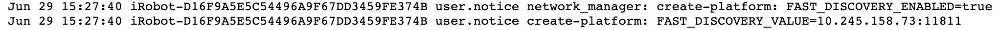

# Fast DDS Discovery Server

This page gives instructions on how to use a Fast DDS discovery server with the Create® 3 robot as a client.
For more information on the Fast DDS discovery server, please refer to the [eProsima documentation](https://fast-dds.docs.eprosima.com/en/latest/fastdds/ros2/discovery_server/ros2_discovery_server.html).

*We’ll use the term "computer" to refer to any SBC (single board computer), virtual machine, personal computer, etc.*

## Configure Server

1. Start the discovery server on the computer that you wish to use as your server by replacing <SERVER_IP> with the computer's IP address.

        fastdds discovery -i 0 -l <SERVER_IP> -p 11811
   
     

## Configure Create® 3 Robot as a Client
!!! important
    If you have enabled the discovery server previously and wish to change the Wi-Fi network you are connected to, make sure the discovery server is disabled in the configuration settings **before** connecting it to a **new** Wi-Fi network.
    The discovery server can be disabled by unchecking the "Enable Fast DDS discovery server?" checkbox in the [webserver application settings](../../webserver/application/), and then saving and restarting the application. 

1. Make sure your Create® 3 robot is connected to Wi-Fi. If it isn't, follow the directions [here](../provision/).

1. Navigate to the robot’s web server via its IP address.
Go to [webserver application settings](../../webserver/application/) and enable the checkbox for the discovery server.
In the field `Address and port of Fast DDS discovery server`, enter the IP address of your server followed by `:11811` (the default port for the Fast DDS discovery server is `11811`, but it is configurable).

1. If you intend on connecting multiple robots to the same discovery server, make sure to give the Create® 3 robot a namespace.
Restart the application after saving all settings.
  

!!! attention
      It is recommended you check the [logs](../../webserver/logs/) to confirm the discovery server has been enabled on the robot. 

## Configure Other Devices as Super Clients 
When using a discovery server with a Create® 3 Robot, all other devices connected to the discovery server must be set up as super clients in order to communicate with the Create® 3 Robot.
Other devices could be any device that runs ROS 2 and wants to communicate with the Create® 3 Robot.

1. Before starting, stop the ROS 2 Daemon with `ros2 daemon stop`.

1. Download the .xml file found [here](data/super_client_configuration_file.xml) and replace VM_IP with your device’s IP address.

1. Navigate to your device and open terminal. If the super client and server are on the same computer, make sure to open a new terminal (separate terminal from where the server is running).

1. Assign your .xml file as your default profile by entering the following.

        export FASTRTPS_DEFAULT_PROFILES_FILE=/path/to/the/xml/profile

1. Now, try looking for the Create® 3 topics list by running `ros2 topic list`.
