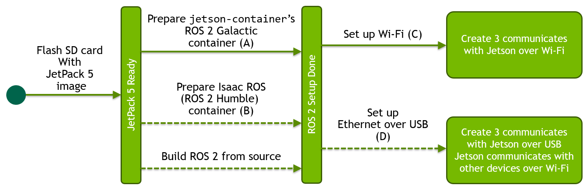
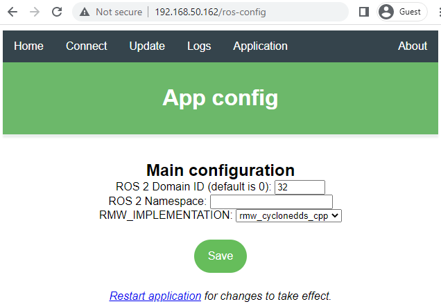

<!--
# SPDX-FileCopyrightText: Copyright (c) 2022 NVIDIA CORPORATION & AFFILIATES. All rights reserved.
# SPDX-FileCopyrightText: Additions copyright (c) 2022 iRobot Corporation. All rights reserved.
# SPDX-License-Identifier: BSD-3-Clause
#
# Redistribution and use in source and binary forms, with or without
# modification, are permitted provided that the following conditions are met:
#
# 1. Redistributions of source code must retain the above copyright notice, this
# list of conditions and the following disclaimer.
#
# 2. Redistributions in binary form must reproduce the above copyright notice,
# this list of conditions and the following disclaimer in the documentation
# and/or other materials provided with the distribution.
#
# 3. Neither the name of the copyright holder nor the names of its
# contributors may be used to endorse or promote products derived from
# this software without specific prior written permission.
#
# THIS SOFTWARE IS PROVIDED BY THE COPYRIGHT HOLDERS AND CONTRIBUTORS "AS IS"
# AND ANY EXPRESS OR IMPLIED WARRANTIES, INCLUDING, BUT NOT LIMITED TO, THE
# IMPLIED WARRANTIES OF MERCHANTABILITY AND FITNESS FOR A PARTICULAR PURPOSE ARE
# DISCLAIMED. IN NO EVENT SHALL THE COPYRIGHT HOLDER OR CONTRIBUTORS BE LIABLE
# FOR ANY DIRECT, INDIRECT, INCIDENTAL, SPECIAL, EXEMPLARY, OR CONSEQUENTIAL
# DAMAGES (INCLUDING, BUT NOT LIMITED TO, PROCUREMENT OF SUBSTITUTE GOODS OR
# SERVICES; LOSS OF USE, DATA, OR PROFITS; OR BUSINESS INTERRUPTION) HOWEVER
# CAUSED AND ON ANY THEORY OF LIABILITY, WHETHER IN CONTRACT, STRICT LIABILITY,
# OR TORT (INCLUDING NEGLIGENCE OR OTHERWISE) ARISING IN ANY WAY OUT OF THE USE
# OF THIS SOFTWARE, EVEN IF ADVISED OF THE POSSIBILITY OF SUCH DAMAGE.
#
-->

# Connect Create® 3 to NVIDIA® Jetson™ and set up ROS 2 Galactic

!!! important
    **This is community-submitted content. Please feel welcome to submit PRs for additions or corrections.**

## Before you start
!!! attention
    **These directions are written for someone with experience with embedded Linux and basic embedded computers.**

It is highly recommended to read through the getting started document for your NVIDIA® Jetson™ developer kit before beginning:

* [Jetson Orin Nano Developer Kit Getting Started Guide](https://developer.nvidia.com/embedded/learn/get-started-jetson-orin-nano-devkit)
* [Getting Started With Jetson Xavier NX Developer Kit](https://developer.nvidia.com/embedded/learn/get-started-jetson-xavier-nx-devkit)
* [Getting Started with Jetson Nano Developer Kit](https://developer.nvidia.com/embedded/learn/get-started-jetson-nano-devkit)
* [Getting Started with Jetson Nano 2GB Developer Kit](https://developer.nvidia.com/embedded/learn/get-started-jetson-nano-2gb-devkit)

## Setup Overview

## ROS 2 Setup on Jetson

### Use pre-built ROS 2 Docker container

The recommended way to run ROS 2 on Jetson is to use pre-built Docker container images.

1. Install NVIDIA Container Runtime with Docker integration

    It should be a part of JetPack, so if you use a NVIDIA supplied JetPack 5 image to flash your SD card, you can skip this process.

        sudo apt update
        sudo apt install nvidia-container

2. Make docker command available without `sudo`

        sudo systemctl restart docker
        sudo usermod -aG docker $USER
        newgrp docker

3. Set `nvidia` as the `default-runtime` for Docker.

    Edit `/etc/docker/daemon.json` to be the following.

        {
            "runtimes": {
                "nvidia": {
                    "path": "/usr/bin/nvidia-container-runtime",
                    "runtimeArgs": []
                }
            },
            "default-runtime": "nvidia"
        }

### A. Use `jetson-containers` ROS 2 Galactic container

Dustin Franklin's `jetson-contianers` GitHub repository provides all the pre-built Docker container images for machine learning and ROS.

1. Use `jetson-containers`' script to simplify the invocation of `docker run` command.

        git clone https://github.com/dusty-nv/jetson-containers/
        cd jetson-containers
        scripts/docker_run.sh -c dustynv/ros:galactic-desktop-l4t-r35.3.1

1. Inside the container, install additional ROS 2 packages

        apt update && apt install -y ros-galactic-irobot-create-msgs

### B. Use Isaac ROS (ROS 2 Humble) container

!!! Attention
    If you chose and performed the above "***Use `jetson-containers` ROS 2 Galactic container***", you can skip this section

NVIDIA Isaac ROS is a collection of hardware-accelerated, high performance, low latency ROS 2 packages that runs on and leverage the power of Jetson.

It comes with a ROS 2 Humble based container, so if you plan to test/use any of Isaac ROS packages, running the Issac ROS container may be a good option.

### E. Build ROS 2 from source

!!! Attention
    If you chose and performed the above "***Use `jetson-containers` ROS 2 Galactic container***", you can skip this section

Jetson's BSP (JetPack 5) is based on Ubuntu 20.04. 
Debian packages for ROS 2 Humble are currently only available for Ubuntu Jammy (22.04), so you would need to build from source if you need to natively install ROS 2 on Jetson.

 
## Communication mode 

### C. Setup Wi-Fi connections.

If you don't need wired communication between Create® 3 and Jetson™, letting them communicate over Wi-Fi is easier than setting Ethernet over USB.

#### Create® 3 Wi-Fi setup

Follow the main guide (https://edu.irobot.com/create3-setup) to connect your Create® 3 to your wireless AP.

Once you connect Create® 3 robot to your wireless AP, and find out the new IP address assigned to your robot, you can access the robot web dashboard by the new IP address.

If you plan to operate multiple Create® 3 robots in the same wireless network, it is a good idea to set "ROS 2 Domain ID" on the "Application" > "Configuration" page.

#### Jetson™ Wi-Fi setup

If you have your Jetson connected to a display monitor ("Monitor-attached" Mode), use the Ubuntu's GUI to setup Wi-Fi connection ([official guide](https://help.ubuntu.com/20.04/ubuntu-help/net-wireless-connect.html.en)).

> If you cannot easily attach a display monitor to your Jetson, check [this guide](https://jetbot.org/master/software_setup/wifi_setup.html#headless-mode) for "Headless Mode".

#### Test inside Jetson ROS container

Perform the following in the ROS 2 container.

1. Set the `ROS_DOMAIN_ID` environment variable

    Once you are in container:

        export ROS_DOMAIN_ID=32

1. Check to ensure Create® 3 topics appear

        ros2 topic list

    You should get

        /battery_state
        /cmd_audio
        /cmd_lightring
        /cmd_vel
        /dock
        /hazard_detection
        /imu
        /interface_buttons
        /ir_intensity
        /ir_opcode
        /kidnap_status
        /mouse
        /odom
        /parameter_events
        /rosout
        /slip_status
        /stop_status
        /tf
        /tf_static
        /wheel_status
        /wheel_ticks
        /wheel_vels

1. Check if it reads a message on a topic

        ros2 topic echo battery_state

    You should see continuous repetition of output like the following.

        header:
          stamp:
            sec: 1683568887
            nanosec: 488023084
          frame_id: ''
        voltage: 16.56999969482422
        temperature: 36.95000076293945
        current: 0.5609999895095825
        charge: 2.075000047683716
        capacity: 2.1500000953674316
        design_capacity: 2.1500000953674316
        percentage: 0.9700000286102295
        power_supply_status: 0
        power_supply_health: 0
        power_supply_technology: 0
        present: true
        cell_voltage: []
        cell_temperature: []
        location: ''
        serial_number: ''
        ---       

### D. Set up Ethernet over USB

!!! Attention
    If you chose and performed the above "***Setup Wi-Fi connections***", you can skip this section.

If you need a reliable wired communication between Create® 3 and Jetson™, you can connect them via a USB cable and let them establish a virtual Ethernet connection over the USB data communication.

Jetson's upstream USB port (USB-C for the case of Jetson Orin Nano Developer Kit and micro-B for the case of Jetson Xavier Developer Kit) is conveniently set up in such a way to present a virtual network card to the host system, so Create® 3 and Jetson can form a virtual Ethernet connection over the USB link.

However, because Create® 3 expects the client device to have a specific IP address (`192.168.186.3`), we need to tweak the Jetson's "USB Device Mode" functionality, that is designed to run a DHCP server on Jetson side to assign IP address to other device by default.

#### Alter "USB Device Mode" to apply static IP

1. To alter the Jetson's "USB Device Mode" feature (specifically, disabling DHCP server and self-assign a static IP address);

    1. First, create a flag file to store IP address for Jetson to be used with Create® 3.

            sudo bash -c 'echo "192.168.186.3" > /opt/nvidia/l4t-usb-device-mode/IP_ADDRESS_FOR_CREATE3_ROBOT.conf'

    2. Then, modify the "nv-l4t-device-mode-runtime" service script (`/opt/nvidia/l4t-usb-device-mode/nv-l4t-usb-device-mode-runtime-start.sh`). The complete file is [here](data/nv-l4t-usb-device-mode-runtime-start.sh).
      

2. Connect USB cable from Create® 3 robot to the upstream USB port of Jetson. Then check if the static IP address is set by issuing `ifconfig` command.

        $ ifconfig l4tbr0

        l4tbr0: flags=4163<UP,BROADCAST,RUNNING,MULTICAST>  mtu 1500
                inet 192.168.186.3  netmask 255.255.255.0  broadcast 192.168.186.255
                inet6 fe80::1  prefixlen 128  scopeid 0x20<link>
                inet6 fe80::ecb6:edff:feac:7dd5  prefixlen 64  scopeid 0x20<link>
                ether ee:b6:ed:ac:7d:d5  txqueuelen 1000  (Ethernet)
                RX packets 169  bytes 36206 (36.2 KB)
                RX errors 0  dropped 0  overruns 0  frame 0
                TX packets 1644  bytes 213306 (213.3 KB)
                TX errors 0  dropped 0 overruns 0  carrier 0  collisions 0

    !!! warning
        Be sure that the [USB/BLE toggle on the robot's adapter board](../../hw/electrical/#adapter-board-overview) is set to the USB position.

3. Check if you can ping Create® 3 robot

        ping 192.168.186.2

    !!! note
        If you ever want to stop using the Jetson device for Create® 3 and re-enable the original USB Device Mode feature (so that you can connect to your Windows PC in headless style), you can simply remove the flag file, or execute the following.

        sudo mv /opt/nvidia/l4t-usb-device-mode/IP_ADDRESS_FOR_CREATE3_ROBOT.conf /opt/nvidia/l4t-usb-device-mode/IP_ADDRESS_FOR_CREATE3_ROBOT.conf.bak

#### Test the USB link inside the container

s in the ROS 2 container.

1. Set the `ROS_DOMAIN_ID` environmental variable 

    Once you are in container;

        export ROS_DOMAIN_ID=32

1. Set the default network interface by setting Cyclone DDS configuration.

        export CYCLONEDDS_URI='<CycloneDDS><Domain><General><NetworkInterfaceAddress>l4tbr0</NetworkInterfaceAddress></General></Domain></CycloneDDS>'

1. Check to ensure Create® 3 topics appear

        ros2 topic list

    You should get

        /battery_state
        /cmd_audio
        /cmd_lightring
        /cmd_vel
        /dock
        /hazard_detection
        /imu
        /interface_buttons
        /ir_intensity
        /ir_opcode
        /kidnap_status
        /mouse
        /odom
        /parameter_events
        /rosout
        /slip_status
        /stop_status
        /tf
        /tf_static
        /wheel_status
        /wheel_ticks
        /wheel_vels

1. Check if it reads a message on a topic

        ros2 topic echo battery_state

    You should see continuous repetition of output like following.

        header:
          stamp:
            sec: 1683568887
            nanosec: 488023084
          frame_id: ''
        voltage: 16.56999969482422
        temperature: 36.95000076293945
        current: 0.5609999895095825
        charge: 2.075000047683716
        capacity: 2.1500000953674316
        design_capacity: 2.1500000953674316
        percentage: 0.9700000286102295
        power_supply_status: 0
        power_supply_health: 0
        power_supply_technology: 0
        present: true
        cell_voltage: []
        cell_temperature: []
        location: ''
        serial_number: ''
        ---       
