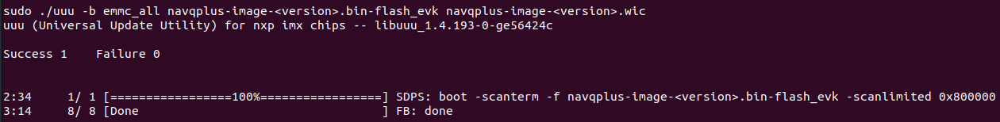

# Connect Create® 3 to NavQ+ and set up ROS 2 Galactic

## Before you start
!!! attention
    **These directions are written for someone with experience with embedded Linux and basic embedded computers.**

## Step-by-step
 
1. Download the [pre-built Ubuntu 20.04 with ROS2 Galactic image](https://github.com/rudislabs/navqplus-create3-images/releases), specifically designed for use with the Create® 3.[^1][^3]
2. Extract the image `navqplus-image-<version>.wic` from the compressed downloaded file `navqplus-image-<version>.wic.bz2` and flash it to an [SD card](#flashing-the-sd-card) or the [EMMC](#flashing-the-emmc).
3. [Log in for the first time](#log-in-for-the-first-time) by connecting to your computer using the [USB to UART adatper](#usb-to-uart-adapter), [ethernet adapter](#ethernet) or [centermost (USB 2) USB-C® port](#usb-c-gadget-ethernet).[^2]
4. [Configure Wifi, System User Name and Password.](#configuring-wifi-system-username-and-password)
5. [Connect NavQ+ to iRobot Create 3](#connecting-to-irobot-create-3)

## Flashing the SD card
The NavQ+ comes with a 32GB SD card that you can flash with the pre-built Ubuntu 20.04 image for iRobot Create 3. See below for instructions to flash your SD card on each platform.

!!! attention
    **You must have an SD card reader available on your system to perform these instructions.**

### Windows
To flash your SD card with the image you downloaded in step 1, we suggest using [Win32DiskImager](https://win32diskimager.org/).

Once you have downloaded Win32DiskImager, insert your SD card into your computer, open the program, and select the `navqplus-image-<version>.wic` file as your image.

Next, select your SD card under Device.

!!! attention
    **Be careful and make sure that your Device selection is the drive letter for your SD card. Don't erase your hard drive!**

Finally, click Write.

Once the flashing process has finished, you should get a message saying that the write was successful.

### Linux / Mac
To flash your SD card with the image you downloaded in step 1, we suggest using `dd`.

To do this, open a terminal and navigate to the folder that you downloaded the `navqplus-image-<version>.wic` file.

Once you are there, insert your SD card, and find the device path for it. Typically, it will be something like `/dev/sdX` on Linux or `/dev/diskX` on Mac.

!!! attention
    **Be careful that you select the correct drive path when using `dd` to flash your SD card. You can confirm with the "Disks" app on Ubuntu or the "Disk Utility" app on Mac.**

Once you have found your device path, run the following command in your terminal to flash the SD card:

Linux:
```
sudo dd if=navqplus-image-<version>.wic of=/dev/sdX bs=1M status=progress oflag=sync
```

Mac:
```
sudo dd if=navqplus-image-<version>.wic of=/dev/diskX bs=1m status=progress oflag=sync
```

Once this is done, your SD card will be flashed with the image. Make sure that your [boot switches](#boot-switches) are set to boot from SD.

## Flashing the eMMC
To flash the eMMC on your NavQ+, you will need to download [UUU](https://github.com/NXPmicro/mfgtools/releases/tag/uuu_1.4.193), a tool created by NXP to flash NXP boards. Make sure to download the correct application for your platform. The file titled "uuu" with no file extension is a binary file for use on x86/64 Linux.

Once you have downloaded UUU, find the [boot switches](#boot-switches) on your NavQ+ and flip them to the "Flash" mode.

Then, connect NavQ+ to your computer using the leftmost (USB 1) USB-C® port and the two flash status light should light up as shown in the image. 


Run the following command to make sure that the NavQ+ is recognized by UUU:

```
./uuu[.exe] -lsusb
```


You should see that there is a device detected. If so, you can continue flashing. To flash your board, use the command below:

```
./uuu[.exe] -b emmc_all navqplus-image-<version>.bin-flash_evk navqplus-image-<version>.wic
```

Once this process has finished, make sure that the flash was successfull by comparing to the image below. If so, configure your [boot switches](#boot-switches) to boot from eMMC.



## Boot Switches

NavQ+ can be configured to boot from either SD card or eMMC. It also has a flash mode that allows you to flash either the eMMC or SD card over USB-C®. See the table below for the boot switch configuration.

| Mode  | Switch 1 | Switch 2 |
| ----- | -------- | -------- |
|  SD   |    ON    |    ON    |
| eMMC  |    OFF   |    ON    |
| Flash |    ON    |    OFF   |


## Log in for the first time

Power on the NavQ+ by plugging in a USB-C® cable to the centermost (USB 2) USB-C® port. NavQ+ will boot, and you will be able to confirm it has fully booted by observing the LEDs on board. The 3 LEDs by the USB1 port should be on, as well as two LEDs next to the CAN bus connectors.

To log into NavQ+, you can use the included USB to UART adapter, Ethernet, or USB-C® gadget mode (recommended). The default username/password combo is as follows:

**Username: user**

**Password: user**

### Expand Image
The flashed images will need expanding to utilize all the available storage.
After logging into the NavQ+ open a terminal and run:

- Expand image on the SD:

```
echo -e "d\n2\nn\np\n2\n196608\n\n\nw" | sudo fdisk /dev/mmcblk1 && sudo resize2fs /dev/mmcblk1p2
```

- Expand image on the eMMC:

```
echo -e "d\n2\nn\np\n2\n196608\n\n\nw" | sudo fdisk /dev/mmcblk2 && sudo resize2fs /dev/mmcblk2p2
```

### USB to UART adapter
Connect the included USB to UART adapter to the UART2 port on the NavQ+, and open your favorite serial console application. Open a serial console with a baud rate of 115200. Press enter if there is no output on the screen to get a log-in prompt. 

### Ethernet
Connect the included IX Industrial Ethernet cable to NavQ+, and connect the RJ45 connector to your computer, switch, or router on your local network. You can log into NavQ+ over SSH. The default hostname for NavQ+ is imx8mpnavq. To SSH into NavQ+, you can run the following command:

```
ssh user@imx8mpnavq.local
```

### USB-C® Gadget Ethernet
The IP address of the `usb0` network interface on NavQ+ is statically assigned to 192.168.186.3. This is necessary to connect to the iRobot Create 3 out of the box. If you want to use USB-C® gadget ethernet to connect to NavQ+, you will need to assign a static IP to your existing gadget ethernet interface on your computer. The network configuration is as follows:

IP Address: 192.168.186.2
Network Mask: 255.255.255.0

Once you have set up your USB-C® gadget ethernet interface on your computer, you can SSH by running:

```
ssh user@imx8mpnavq.local
```

## Configuring WiFi, System Username and Password

### Configuring WiFi on NavQ+
To connect NavQ+ to your local WiFi network, you can use the `nmtui` command. This command presents a GUI in your terminal to connect to WiFi. The interface is relatively straightforward. To run `nmtui`, run the following command:

```
sudo nmtui
```

Once you are finished connecting to your local WiFi network, you can exit the application. Your NavQ+ will continue to connect to this WiFi network even after a reboot.

### Configuring System Username and Password

To change the default username and password, use the commands below.

Username:
```
usermod -l <new_username> user
mv /home/user /home/<new_username>
```

Password:
```
passwd
```

## Connecting to iRobot Create 3
Once you have set up your NavQ+ to connect to your local WiFi network, you can now connect it to the iRobot Create 3. Simply connect a USB-C® cable between NavQ+'s centermost (USB 2) USB-C® port and the USB-C® port internal to the iRobot Create 3. Your NavQ+ and iRobot Create 3 will now be communicating over CycloneDDS for ROS2! SSH into your NavQ+ over WiFi by running:

```
ssh <your-username>@imx8mpnavq.local
```

[^1]: Ubuntu is a registered trademark of Canonical Ltd.
[^2]: USB-C® is a trademark of USB Implementers Forum.
[^3]: ROS 2 is governed by Open Robotics
