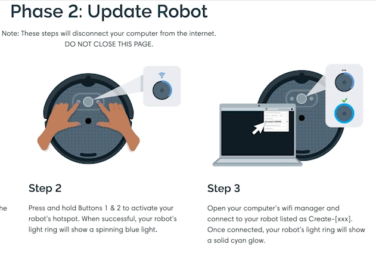
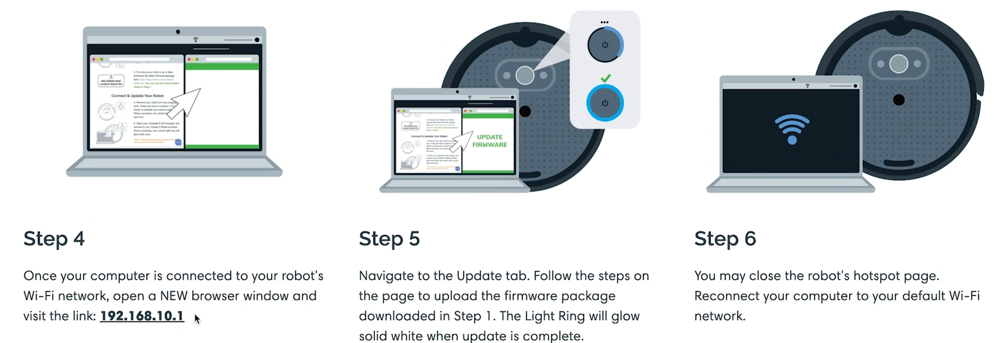
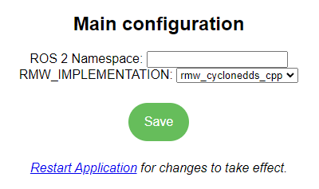

# Connect Create® 3 to Wi-Fi
## The Basics
Power on your Create3 by plugging in your dock and putting the Create3 on the dock.  You should see the lightring spin with a white light for several minutes while the robot boots up.  The robot has finished booting when the light ring dims to a softer white and the robot plays a startup sound.

Ensure you are using the release you want.
A detailed rundown of the releases can be found on the [Releases](../releases/overview.md) page.  You can download the release you want.

Enter the robot into AP mode where it will advertise as an access point you can connect your computer to.  Hold buttons 1 & 2 for 3 seconds until the light ring starts spinning with a blue light and the robot plays a sound.  Then go to your computer's wifi manager and look for an access point with the name "Create-[xxx]".  It may take a couple of minutes for the Create3 to show in the list of wifi networks.  Connect to that AP.  You will know your computer connected if the Create3 light right changes to a solid Cyan light.
!!! important
    Your computer will disconnect from the internet when it is connected to the Create3's AP

After your computer is connected to the robot, open up a web browser and visit the link 192.168.10.1.  This should open up the Create's web server.  If you want to update the firmware, navigate to the "Update" tab.  Follow the steps on that page to upload the firmware package you downloaded above.  You will see the progress bar moving and the light ring will spin white.  The Light Ring will glow solid white when the update is complete.

To connect your Create3 to your wifi network.  Follow the same steps above to connect to the robot's webserver and choose the "Connect" tab.  Here you can specify your wifi network.

## Select RMW Implementation
If you are planning to use ROS 2[^1], make sure you have selected the matching RMW (ROS 2 middleware) implementation as the rest of the nodes in your system.
This can be found in the Application &rarr; Configuration menu in the Create® 3 robot's web server, shown in the below image.

The default RMW for ROS 2 Galactic is Cyclone DDS.
Be sure to click "save" after making any changes, and then restart the application.
!!! attention
    **As of Create 3 software version G.2.2, there is a memory leak in Cyclone DDS that can cause the robot to reboot after a few hours of use. Please monitor [this issue](https://github.com/ros2/rmw_cyclonedds/issues/388) for further information. Fast-DDS does not have this problem.**

See [ROS 2 Middleware Config](xml-config.md) for more information about RMW specific choices and configuration requirements.

A detailed rundown of the features of the robot webserver can be found on the [Application](../webserver/application.md) page.

## Using Multiple Robots

!!! important
    If you plan to use multiple Create® 3 robots connected to the same Wi-Fi network, then **you must follow the [Multi-Robot Setup documentation](multi-robot.md)**

[^1]: ROS 2 is governed by Open Robotics
