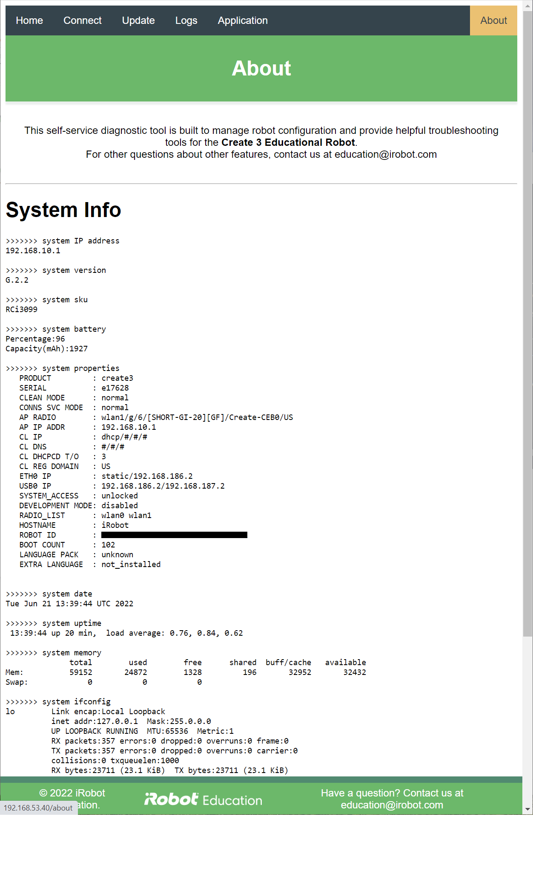

# iRobot® Create® 3 Webserver - About
The about page includes details about the state at the operating system level.

## IP Address
This is the dotted octet IP address currently used to access this page.

## Version
This is the raw version string of the firmware currently loaded on the robot.

## SKU
This is the SKU that iRobot uses to identify the Create® 3 robot.

## Battery
This includes both the percentage charge of the robot's smart battery, as well as the current capacity in milliamp-hours.

## Properties
This section includes iRobot-specific diagnostic information about this robot.

## Date
The current date and time on the robot.

## Uptime
The amount of time since this robot's last reboot.

## Memory
Total RAM and swap space available on the robot.

## ifconfig
Output of the `ifconfig` command, including information for all available Ethernet interfaces.
These may include `lo`, `usb0`, `wlan0`, and/or `wlan1` depending on the state of the robot.
Note that `wlan0` and `wlan1` are the same physical device, except that `wlan0` is used when the robot is a station, and `wlan1` is used when it is an access point.

## hciconfig
Output of the `hciconfig` command, including information for all available Bluetooth®[^1] interfaces.
This will be blank when the USB/BLE toggle on the [adapter board](../hw/adapter.md) is set to USB.

## Factory Reset
A hyperlink to factory reset the robot will appear when the robot is in access point mode.
This will remove all user configuration, but the firmware version will not change.

[^1]: The Bluetooth® word mark and logos are registered trademarks owned by Bluetooth SIG, Inc. and any use of such marks by iRobot is under license.
[^2]: All other trademarks mentioned are the property of their respective owners.