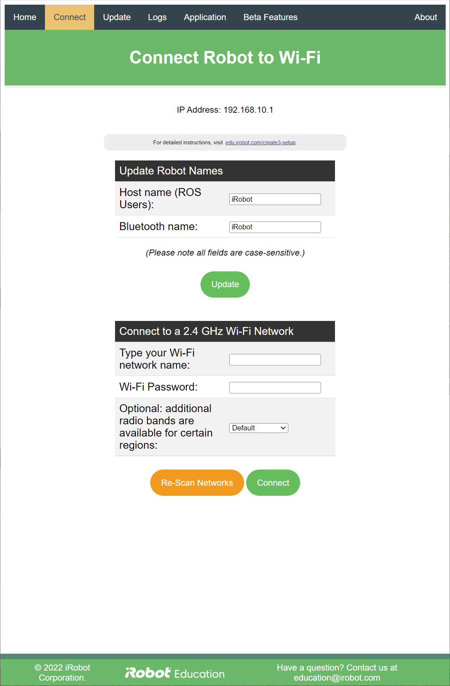

# iRobot® Create® 3 Webserver - Connect
The connect page of the Create® 3 webserver allows the robot's name to be changed, and also is used to provision the robot to a 2.4 GHz Wi-Fi network.

The top of the connect page gives the robot's current IPv4 address.

The "Update Robot Names" box allows the user to change the robot's hostname (which can also be used to find the robot using mDNS) and its Bluetooth name (which can be used to find it using the iRobot Education Bluetooth®[^1] protocol.)

The "Connect to a 2.4 GHz Wi-Fi Network" box allows the user to connect to any network the robot can perceive.
Clicking on the box to the right of "Type your Wi-Fi network name" should yield a drop-down of all available networks.

It may be necessary to change the drop-down for additional radio bands, depending on the region in which the robot is used.
If you are using the robot in Japan (JP), please select "Japan;" if you are using the robot in any of (AS, CA, FM, GU, KY, MP, PR, TW, UM, US, or VI), please select "North America."

[^1]: The Bluetooth® word mark and logos are registered trademarks owned by Bluetooth SIG, Inc. and any use of such marks by iRobot is under license.
[^2]: All trademarks mentioned are the property of their respective owners.