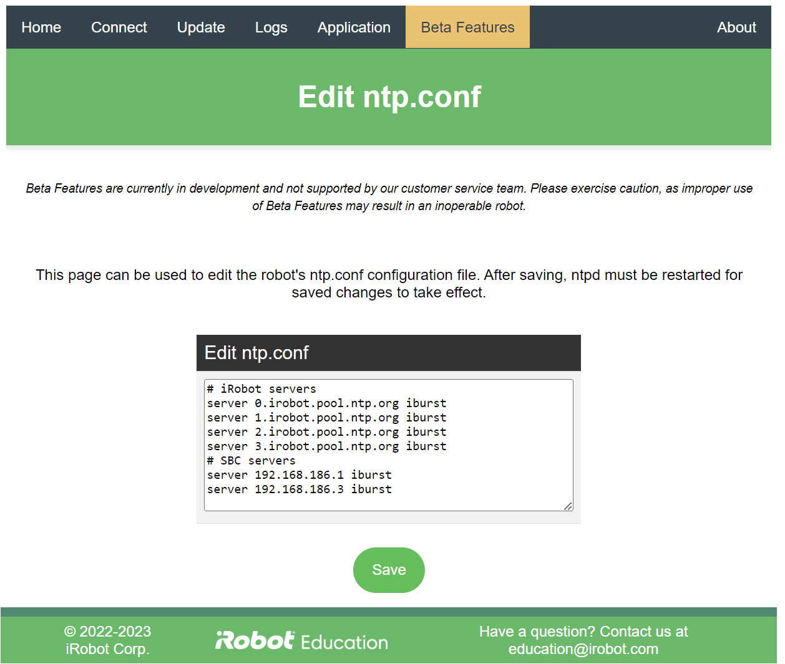

# iRobot® Create® 3 Webserver - Edit ntp.conf
The Edit ntp.conf page of the Create® 3 webserver allows the user to modify the robot's NTP daemon configuration file.

!!!warning
    Please note that this is a beta feature, and as such is not supported by the customer service team.
    Please exercise caution, as improper use of beta features may result in an inoperable robot.

This page allows the user to directly edit `ntp.conf` on the robot. After pressing "save," the NTP daemon must be [restarted](../webserver/restart-ntpd.md).

[^1]: All trademarks mentioned are the property of their respective owners.