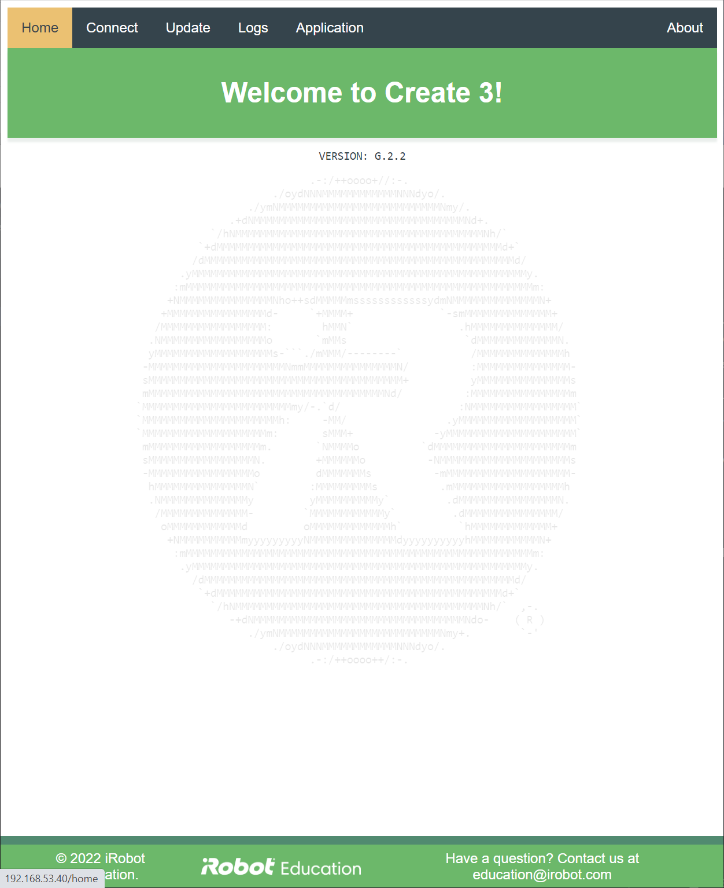

# iRobot® Create® 3 Webserver - Home
The home page of the Create® 3 webserver includes the version number of the robot.

When the robot is in access point mode, an "Identify Robot" button appears between the banner and version number.
Pressing this button will cause the robot to emit a chime.
This may be helpful in order to find a particular robot while provisioning multiple robots at once.

[^1]: All trademarks mentioned are the property of their respective owners.