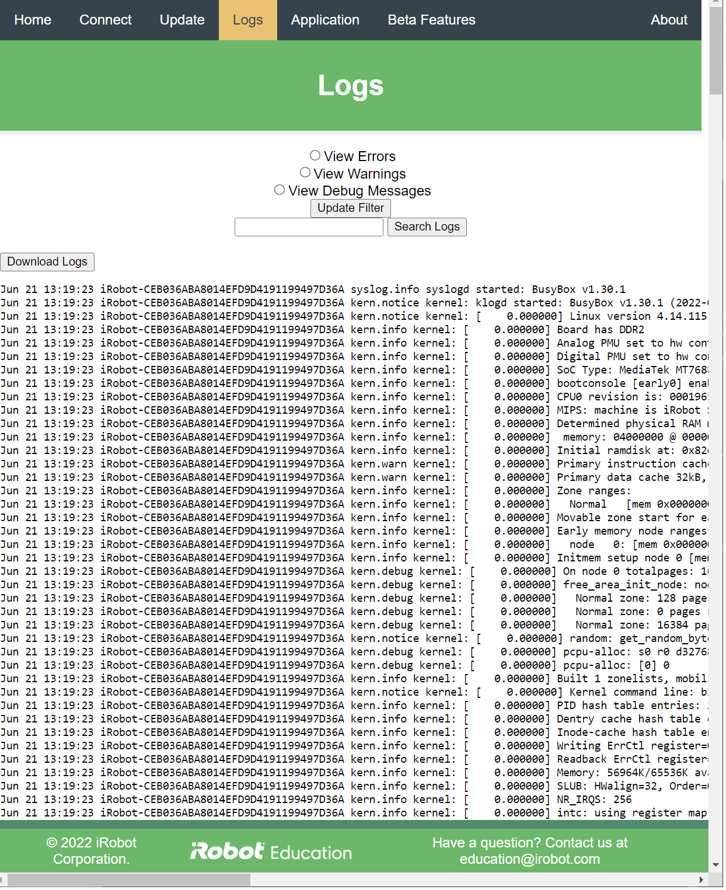

# iRobot® Create® 3 Webserver - Logs
The logs page of the Create® 3 webserver provides an interface for accessing the robot's system log.

Note that the logs are lost when the robot loses power.
Clicking "Download Logs" will pull a raw text file including the logs show on this page; this can also be accessed at `/logs-raw` on the webserver.

[^1]: All trademarks mentioned are the property of their respective owners.