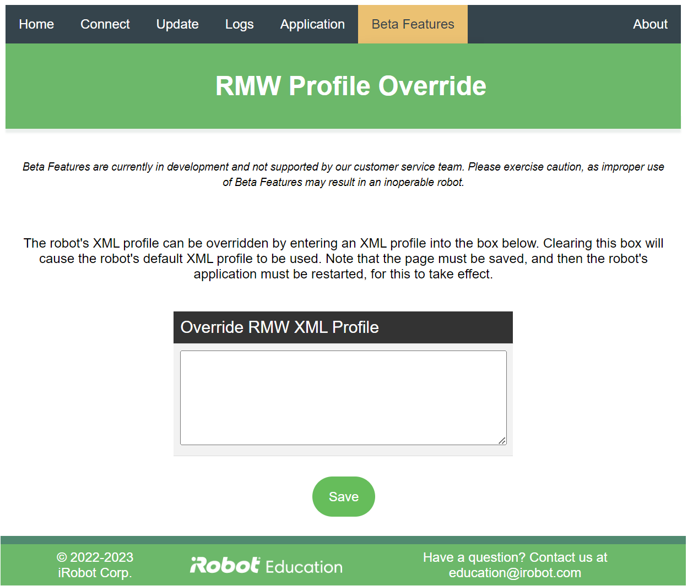

# iRobot® Create® 3 Webserver - Override RMW Profile
The Override RMW Profile page of the Create® 3 webserver allows the user to override the robot's inbuilt RMW profiles for its middleware.

!!!warning
    Please note that this is a beta feature, and as such is not supported by the customer service team.
    Please exercise caution, as improper use of beta features may result in an inoperable robot.

<br><br>

## Usage
This page allows the user to replace the robot's middleware XML profile file with one of their choosing.
Leave this box blank in order to use the robot's default profile file.

!!!important
    After pressing "save," the application must be [restarted](../application/#restart-application).

More details about the XML configuration file can be found on respective vendor sites:

* [Cyclone DDS](https://github.com/eclipse-cyclonedds/cyclonedds/blob/master/docs/manual/options.md)
* [Fast DDS](https://fast-dds.docs.eprosima.com/en/latest/fastdds/xml_configuration/xml_configuration.html)

## Example for Cyclone DDS
Replace `INTERFACE` with interface(s) of choice (for example, `usb0,wlan0` to communicate on both the USB and Wi-Fi interfaces)

```xml
<CycloneDDS>
   <Domain>
     <General>
        <NetworkInterfaceAddress>INTERFACE</NetworkInterfaceAddress>
    </General>
   </Domain>
</CycloneDDS>
```

## Example for Fast DDS
```xml
<?xml version="1.0" encoding="UTF-8" ?>
<profiles xmlns="http://www.eprosima.com/XMLSchemas/fastRTPS_Profiles">
    <transport_descriptors>
        <transport_descriptor>
            <transport_id>udp_transport</transport_id>
            <type>UDPv4</type>
            <maxMessageSize>65000</maxMessageSize>
        </transport_descriptor>
    </transport_descriptors>

    <participant profile_name="broadcast_discovery" is_default_profile="true">
       <rtps>
            <userTransports>
                <transport_id>udp_transport</transport_id>
            </userTransports>
            <useBuiltinTransports>false</useBuiltinTransports>
       </rtps>
    </participant>
</profiles>
```

[^1]: All trademarks mentioned are the property of their respective owners.