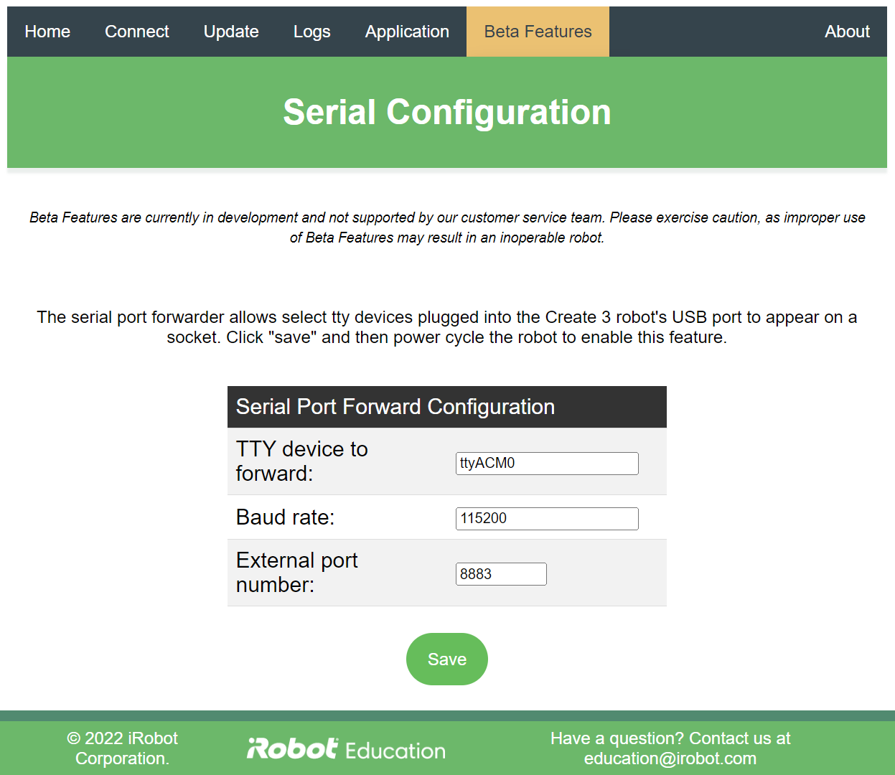

# iRobot® Create® 3 Webserver - Serial Configuration
The Serial Configuration page of the Create® 3 webserver configures a feature which can forward certain USB devices over a socket.

!!!warning
    Please note that this is a beta feature, and as such is not supported by the customer service team.
    Please exercise caution, as improper use of beta features may result in an inoperable robot.

To enable this feature on the robot the first time, it is necessary to navigate to this page, press save, and then reboot the robot.
Subsequent saved changes on this page do not require a reboot; they simply require an unplug-plug sequence to trigger the daemon.

The "TTY device to forward" box tells the Create 3 robot what device to forward; this is the device's name as it would appear in `/dev`.
Plugging a supported device into the robot should produce messages in the log from the kernel, from which this device name can be found.

The "baud rate" box should be set to match the device in question.

The "external port number" can be set to anything, as long as it is `8883`.
The port number may become more configurable when this feature comes out of beta.

[^1]: All trademarks mentioned are the property of their respective owners.