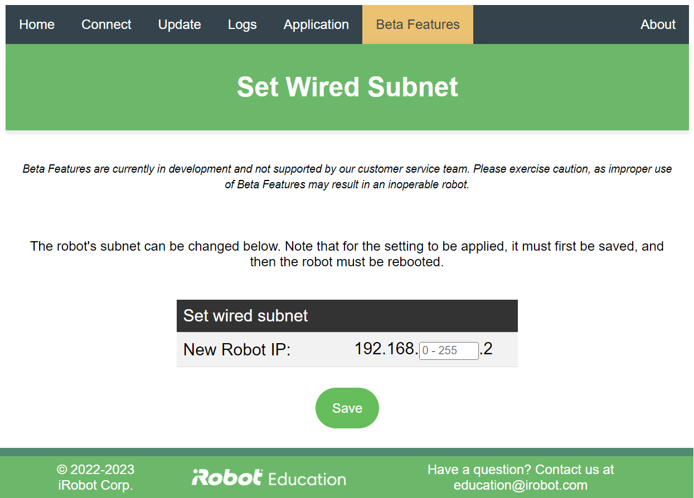

# iRobot® Create® 3 Webserver - Set Wired Subnet
The Set Wired Subnet page of the Create® 3 webserver allows the user to change the robot's /24 subnet within the class C private address area.

!!!warning
    Please note that this is a beta feature, and as such is not supported by the customer service team.
    Please exercise caution, as improper use of beta features may result in an inoperable robot.

This page allows the user to change the robot's /24 subnet within the class C private address area (192.168.nnn.0/24).
After pressing "save," the robot must have its power cycled in order for the change to be made.

[^1]: All trademarks mentioned are the property of their respective owners.