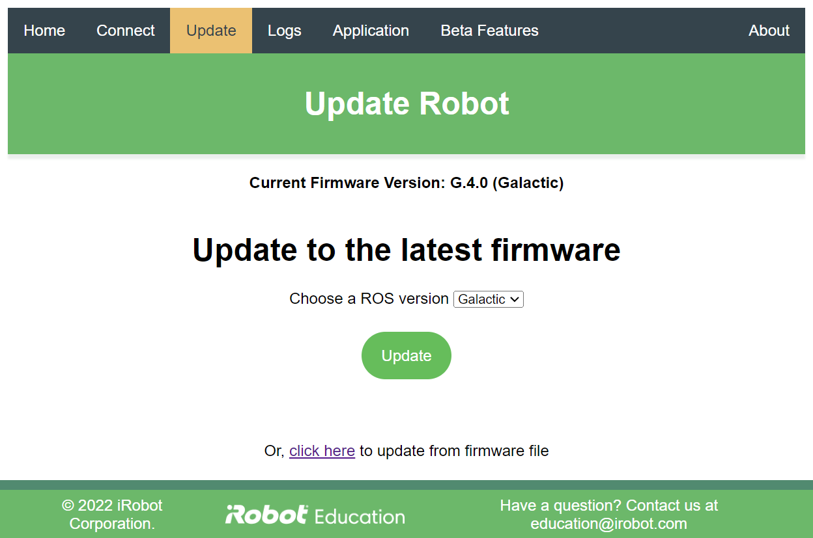
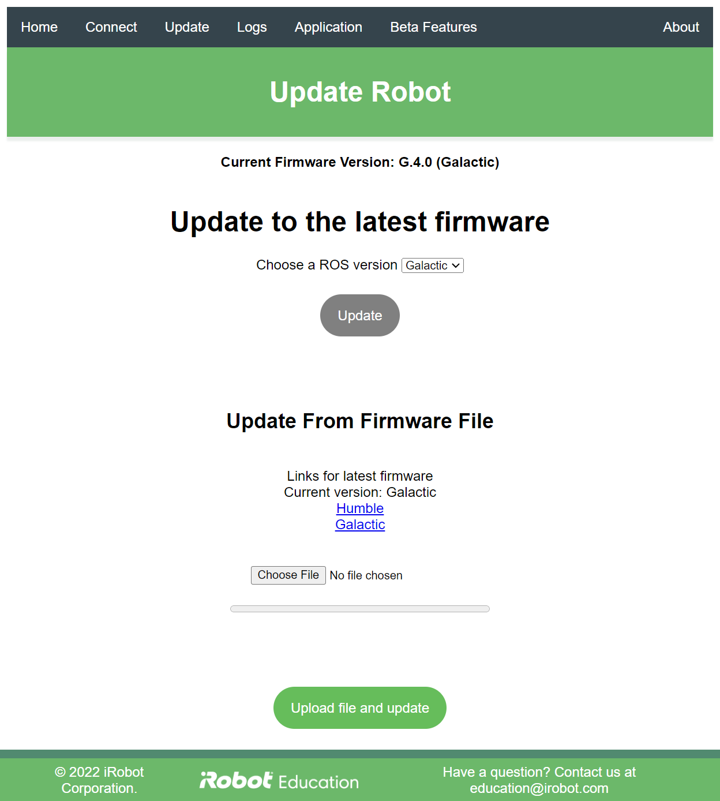

# iRobot® Create® 3 Webserver - Update
The update page of the Create® 3 webserver provides an interface for updating the robot's firmware.

The top of the connect page gives the robot's current firmware version, calling out the robot's current ROS 2[^1] version.

When the robot is on the Internet, a button will appear at the top of the page which should cause the robot to download the most recent update from iRobot's web site and then flash it to the robot.
A drop-down box is available to select the latest firmware release for available ROS 2 versions.
The default selection will be the latest firmware release for the currently installed ROS 2 version.

If a specific firmware version is needed, there is a hyperlink which will expand the menu in order to allow the user to upload firmware of their choosing.

Clicking the "choose file" button will allow the user to select a local firmware file; once selected, click "upload file and update" to begin the process.

This video outlines the steps in detail:
<h1 align="center">
    

    

        <iframe width="450" height="300" src="https://bcove.video/3OejOg5" frameborder="1" allowfullscreen></iframe>
    

    

</h1>

[^1]: ROS 2 is governed by Open Robotics
[^2]: All trademarks mentioned are the property of their respective owners.